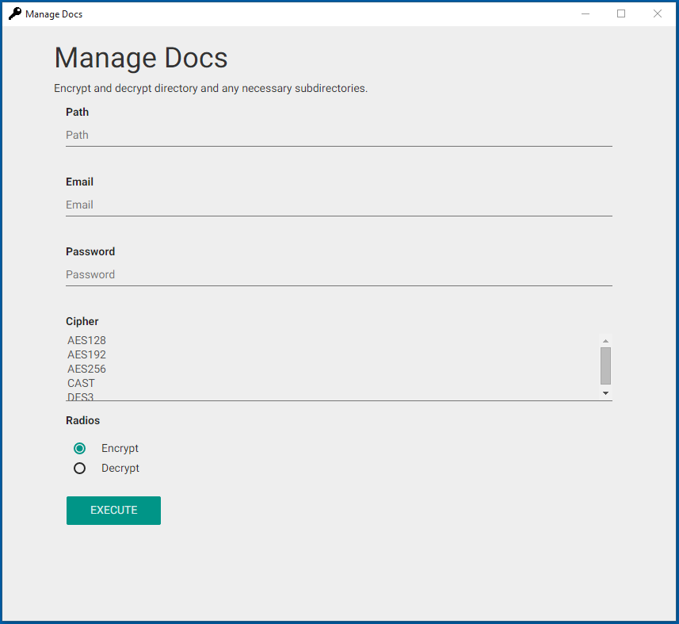

# Manage Docs

At the origin this software had to be a desktop application to manage your economic documents, but now it'll be a desktop application to encrypt and decrypt directory and any necessary subdirectories.

## Installation

1. [Download](https://github.com/cedced19/manage-docs/releases/latest)
2. Extract
3. Execute `manage-docs.exe`



## To compile

```
npm install
gulp
```
or
```
npm install
gulp dist-win
```
